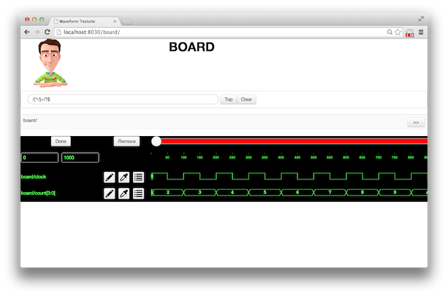

A Django app to view simulation traces (VCD) with a responsive HTML5 interface.

Installation
============

You will first need to install [vcd2json](https://github.com/fortylines/vcd2json).

After cloning the repository, create a virtualenv environment, install
the prerequisites, create the database, then run the testsite webapp.

    $ virtualenv-2.7 _installTop_
    $ source _installTop_/bin/activate
    $ pip install -r requirements.txt
    $ python manage.py syncdb
    $ python manage.py runserver

    # Browse http://localhost:8000/

Note you might have to adjust your LD_LIBRARY_PATH or DYLD_LIBRARY_PATH
shell variable to find the dynamic library. For example:

    $ export DYLD_LIBRARY_PATH=$VIRTUAL_ENV/lib

Remarks
=======

Of course, you can bypass the whole installation procedure,
register at [fortylines.com](https://fortylines.com) and
start running your Verilog in the cloud right away!

